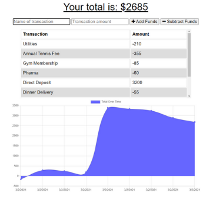

# Budget-Tracker
<h3><u>Title: Budget Tracker<u></h3>
<h5>A Progressive Web App</h5>

<h3>Description:</h3> 
This project delivers a progressive web application-- Budget Tracker -- that allows a user to enter simple budget transactions and charts those transactions.  When a user wants to log a transaction, they need to enter the transaction name (i.e "Groceries" or "Paycheck"), enter the transaction amount, and select the appropriate button to either 
"+ Add Funds" or "-Subtract Funds".  The app logs the transaction, then charts all transaction dates, and cooresponding budget totals in an area chart. 

Budget Tracker has offline capabilities in that a user can continue entering transactions when offline. Those transactions will be cached and the database updated when the user is online again, thus retaining both their online and offline entries.  A service-worker.js file and manifest file are included in the app to allow for the offline functionality, and indexedDB is used to store client side data. The application database is on MongoDB Cloud Atlas and the deployed application is found on heroku: https://immense-basin-97081.herokuapp.com/

<h3>Overview Snapshot of User Interface:</h3> 

    

<h3>Installation:</h3>
To set-up the development environment, clone the repository found at https://github.com/lauramparker/budget-tracker. To run the application, the following npm packages need installation:
   npm install
   npm install node
   npm install mongoose
   npm install indexeddb

To run the application locally, navigate to the path containing the server.js file and, from the command line, enter node server. Then, open your browser and type the local PORT, ie:  http://localhost:3000/
    
    Alternatively, access this application on heroku where it is deployed:  
    https://immense-basin-97081.herokuapp.com/
    
    

<h3>Usage:</h3> Use this project as an example of a Progressive Web Application using a service-worker and manifest

<h3>Credits:</h3> Laura Parker @lauramparker (author)

<h3>License:</h3> MIT   <i>Please use this project for your own learning!</i> 
